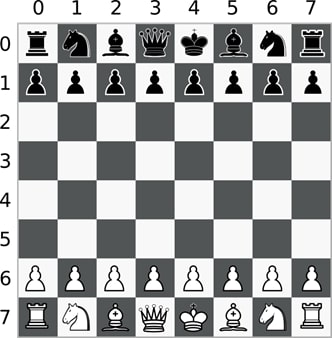

## Knights Travails

**Knights travails** is a library that computes which sequence of moves a knight would take from one arbitrary square on chessbord to another at a minimum. It constructs an unweighted graph of all the chess squares connected by knight movements and find the shortest path with modified [dijkstra alogrithm](https://en.wikipedia.org/wiki/Dijkstra%27s_algorithm).

### Installation and Usage

Run `npm install knights-travails` in a directory. From the same directory, you can import and use it in a JavaScript file, like this : 

```JavaScript
import KnightShortestPathFinder from 'knights-travails';

const knightPathFinder = new KnightShortestPathFinder([0, 0], [7, 7]);
console.log(knightPathFinder.findShortestPath());

/* Output:

[
  [ 0, 0 ], [ 1, 2 ],
  [ 2, 4 ], [ 3, 6 ],
  [ 4, 4 ], [ 5, 6 ],
  [ 7, 7 ]
]

*/
```

You can name the imported class other than the one in the example since it's a default import. 

Also the class constructor uses `[row, column]` format to represent a single individual chess square. So the white king in the picture below will be annotated as `[7, 4]` and the black king as `[0, 4]`.




